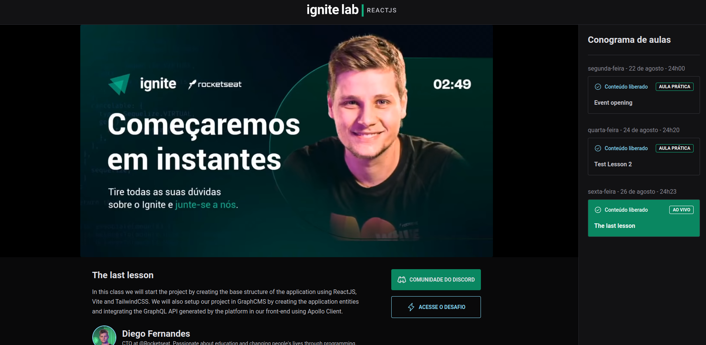

  

A platform for you to make your event available. Developed in a @Rocketseat bootcamp.

<h2> :book: About</h2>

In this project we use hygraph which is a graphql CMS so we don't need to create a backend. Graphql codegen was used to automatically generate typings and hooks based on queries and mutations. Application icons were obtained through phosphor. To display the videos, the lib vime was used.

<h2> :clipboard: Execution Instruction</h2>

1) Create a .env.local and fill the api url and access token

2) You can clone the hygraph database using the url: https://rseat.in/lab-graphcms 

3) `yarn` and `yarn dev` 

